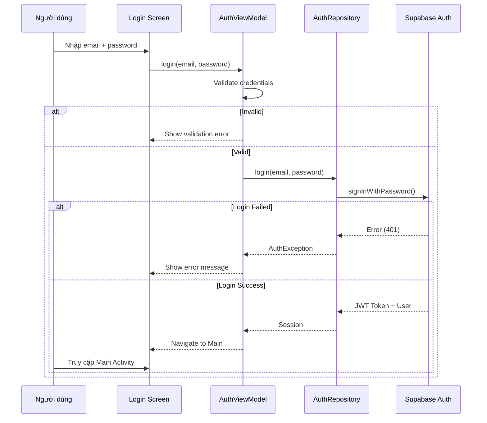
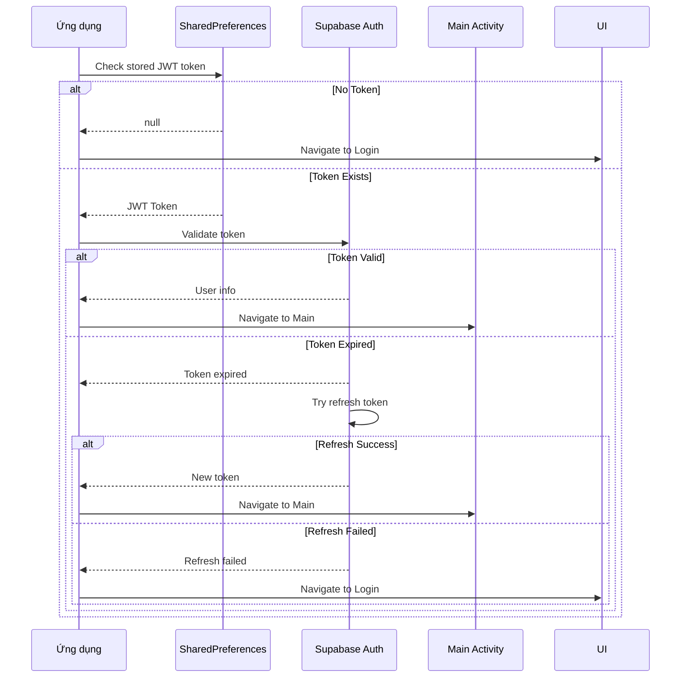
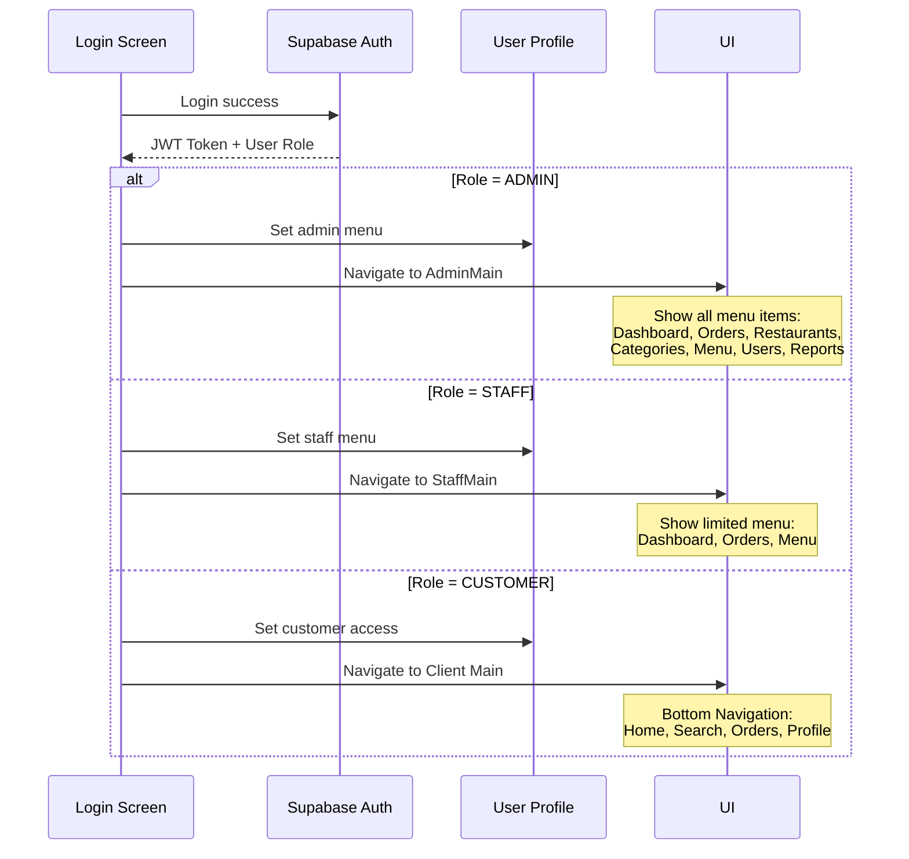
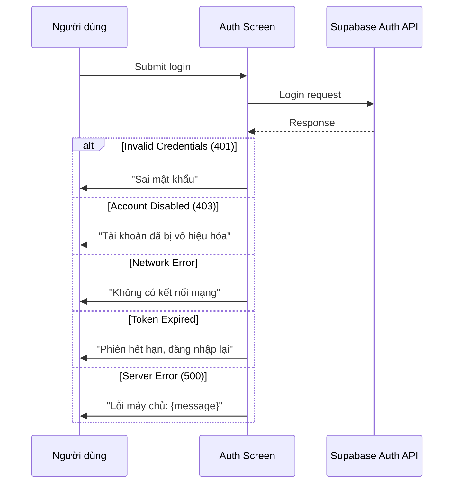

# Sơ đồ luồng - Module Xác thực (Mermaid)

## 1. Login Flow

```mermaid
sequenceDiagram
    participant User as Người dùng
    participant UI as Login Screen
    participant VM as AuthViewModel
    participant Repo as AuthRepository
    participant Supabase as Supabase Auth

    User->>UI: Nhập email + password
    UI->>VM: login(email, password)
    
    VM->>VM: Validate credentials
    
    alt Invalid
        VM-->>UI: Show validation error
    else Valid
        VM->>Repo: login(email, password)
        Repo->>Supabase: signInWithPassword()
        
        alt Login Failed
            Supabase-->>Repo: Error (401)
            Repo-->>VM: AuthException
            VM-->>UI: Show error message
        else Login Success
            Supabase-->>Repo: JWT Token + User
            Repo-->>VM: Session
            VM-->>UI: Navigate to Main
            User->>UI: Truy cập Main Activity
        end
    end
```

## 2. Session Management Flow

```mermaid
sequenceDiagram
    participant App as Ứng dụng
    participant Storage as SharedPreferences
    participant Auth as Supabase Auth
    participant Main as Main Activity

    App->>Storage: Check stored JWT token
    
    alt No Token
        Storage-->>App: null
        App->>UI: Navigate to Login
    else Token Exists
        Storage-->>App: JWT Token
        App->>Auth: Validate token
        
        alt Token Valid
            Auth-->>App: User info
            App->>Main: Navigate to Main
        else Token Expired
            Auth-->>App: Token expired
            Auth->>Auth: Try refresh token
            
            alt Refresh Success
                Auth-->>App: New token
                App->>Main: Navigate to Main
            else Refresh Failed
                Auth-->>App: Refresh failed
                App->>UI: Navigate to Login
            end
        end
    end
```

## 3. Role-Based Navigation Flow

```mermaid
sequenceDiagram
    participant Login as Login Screen
    participant Auth as Supabase Auth
    participant User as User Profile
    
    Login->>Auth: Login success
    Auth-->>Login: JWT Token + User Role
    
    alt Role = ADMIN
        Login->>User: Set admin menu
        Login->>UI: Navigate to AdminMain
        Note over UI: Show all menu items:<br/>Dashboard, Orders, Restaurants,<br/>Categories, Menu, Users, Reports
    else Role = STAFF
        Login->>User: Set staff menu
        Login->>UI: Navigate to StaffMain
        Note over UI: Show limited menu:<br/>Dashboard, Orders, Menu
    else Role = CUSTOMER
        Login->>User: Set customer access
        Login->>UI: Navigate to Client Main
        Note over UI: Bottom Navigation:<br/>Home, Search, Orders, Profile
    end
```

## 4. Error Handling Flow

```mermaid
sequenceDiagram
    participant User as Người dùng
    participant UI as Auth Screen
    participant API as Supabase Auth API
    
    User->>UI: Submit login
    UI->>API: Login request
    
    API-->>UI: Response
    
    alt Invalid Credentials (401)
        UI->>User: "Sai mật khẩu"
    else Account Disabled (403)
        UI->>User: "Tài khoản đã bị vô hiệu hóa"
    else Network Error
        UI->>User: "Không có kết nối mạng"
    else Token Expired
        UI->>User: "Phiên hết hạn, đăng nhập lại"
    else Server Error (500)
        UI->>User: "Lỗi máy chủ: {message}"
    end
```