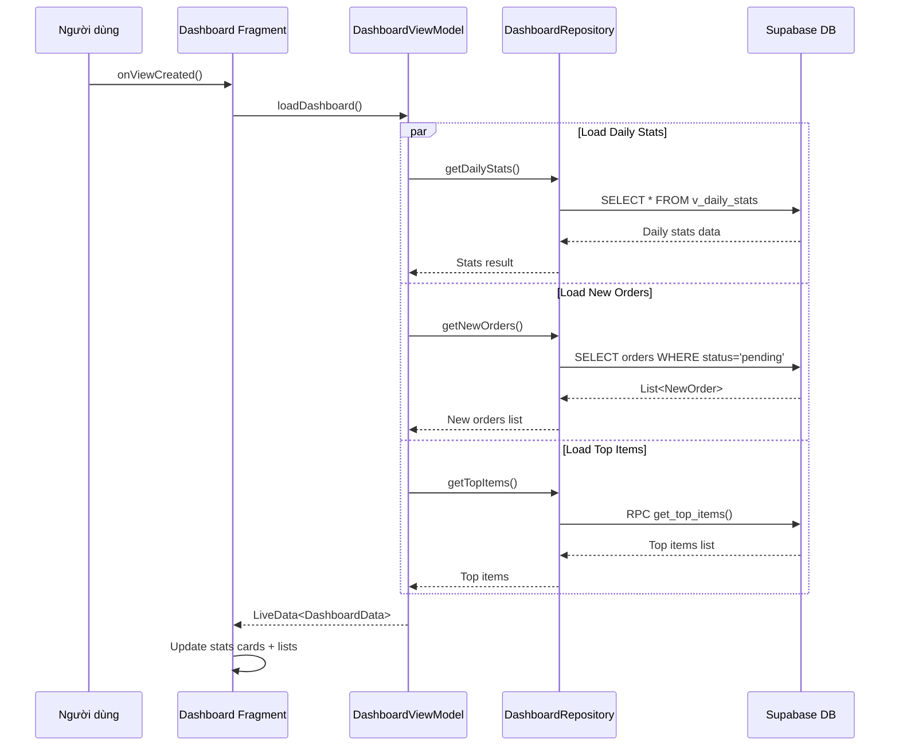
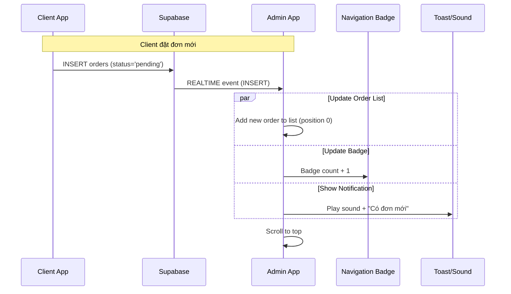
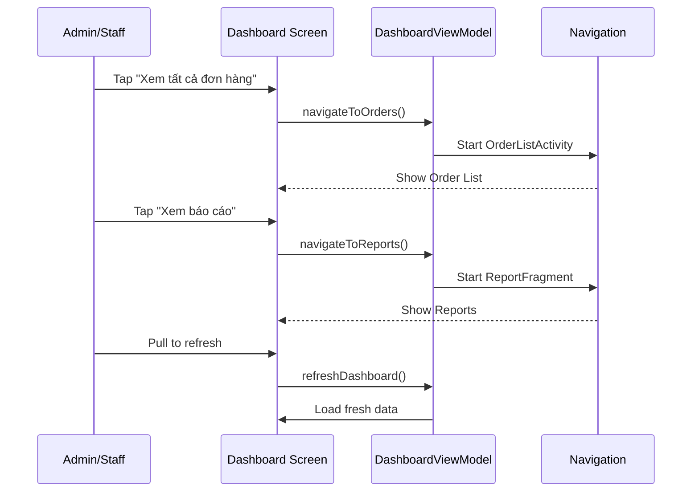

# Sơ đồ luồng - Module Dashboard (Mermaid)

## 1. Dashboard Data Flow

```mermaid
sequenceDiagram
    participant User as Người dùng
    participant UI as Dashboard Fragment
    participant VM as DashboardViewModel
    participant Repo as DashboardRepository
    participant Supabase as Supabase DB

    User->>UI: onViewCreated()
    UI->>VM: loadDashboard()
    
    par Load Daily Stats
        VM->>Repo: getDailyStats()
        Repo->>Supabase: SELECT * FROM v_daily_stats
        Supabase-->>Repo: Daily stats data
        Repo-->>VM: Stats result
    and Load New Orders
        VM->>Repo: getNewOrders()
        Repo->>Supabase: SELECT orders WHERE status='pending'
        Supabase-->>Repo: List<NewOrder>
        Repo-->>VM: New orders list
    and Load Top Items
        VM->>Repo: getTopItems()
        Repo->>Supabase: RPC get_top_items()
        Supabase-->>Repo: Top items list
        Repo-->>VM: Top items
    end
    
    VM-->>UI: LiveData<DashboardData>
    UI->>UI: Update stats cards + lists
```

## 2. Realtime Updates Flow

```mermaid
sequenceDiagram
    participant Client as Client App
    participant Supabase as Supabase
    participant Admin as Admin App
    participant Badge as Navigation Badge
    participant Toast as Toast/Sound

    Note over Client, Admin: Client đặt đơn mới
    
    Client->>Supabase: INSERT orders (status='pending')
    
    Supabase->>Admin: REALTIME event (INSERT)
    
    par Update Order List
        Admin->>Admin: Add new order to list (position 0)
    and Update Badge
        Admin->>Badge: Badge count + 1
    and Show Notification
        Admin->>Toast: Play sound + "Có đơn mới"
    end
    
    Admin->>Admin: Scroll to top
```

## 3. Dashboard Actions Flow

```mermaid
sequenceDiagram
    participant User as Admin/Staff
    participant UI as Dashboard Screen
    participant VM as DashboardViewModel
    participant Nav as Navigation

    User->>UI: Tap "Xem tất cả đơn hàng"
    UI->>VM: navigateToOrders()
    VM->>Nav: Start OrderListActivity
    Nav-->>UI: Show Order List
    
    User->>UI: Tap "Xem báo cáo"
    UI->>VM: navigateToReports()
    VM->>Nav: Start ReportFragment
    Nav-->>UI: Show Reports
    
    User->>UI: Pull to refresh
    UI->>VM: refreshDashboard()
    VM->>UI: Load fresh data
```