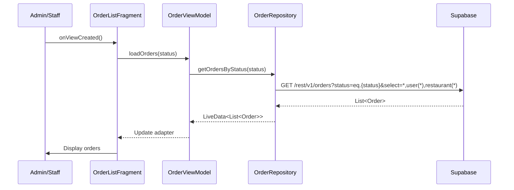
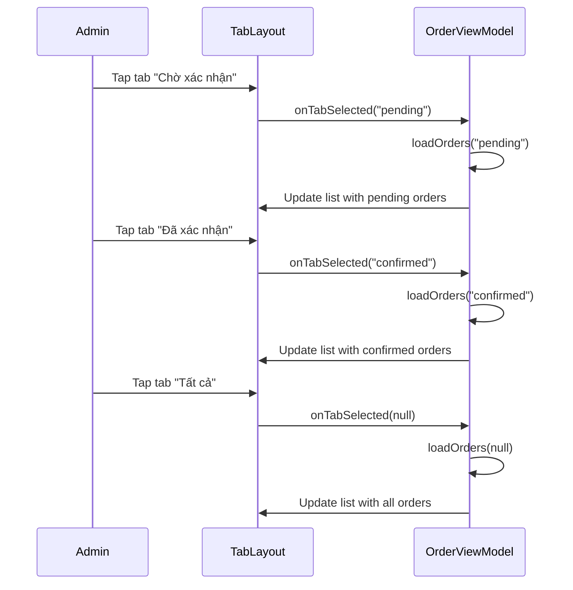
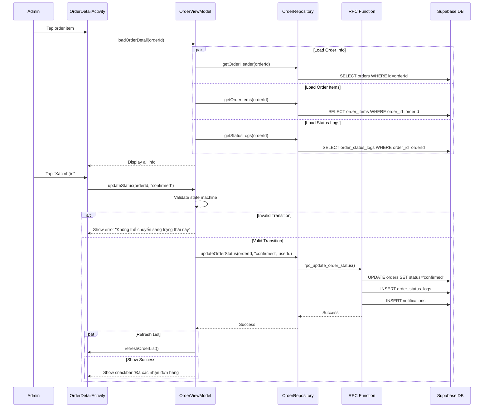
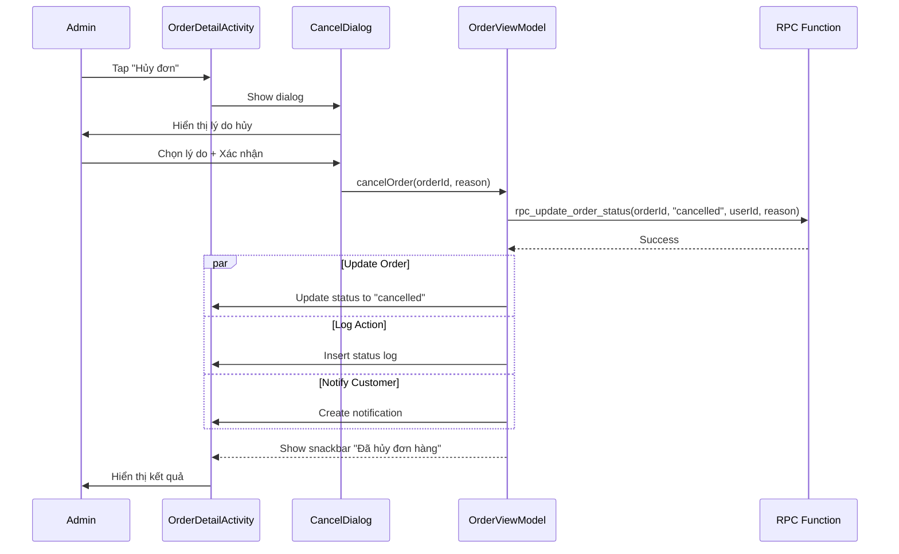
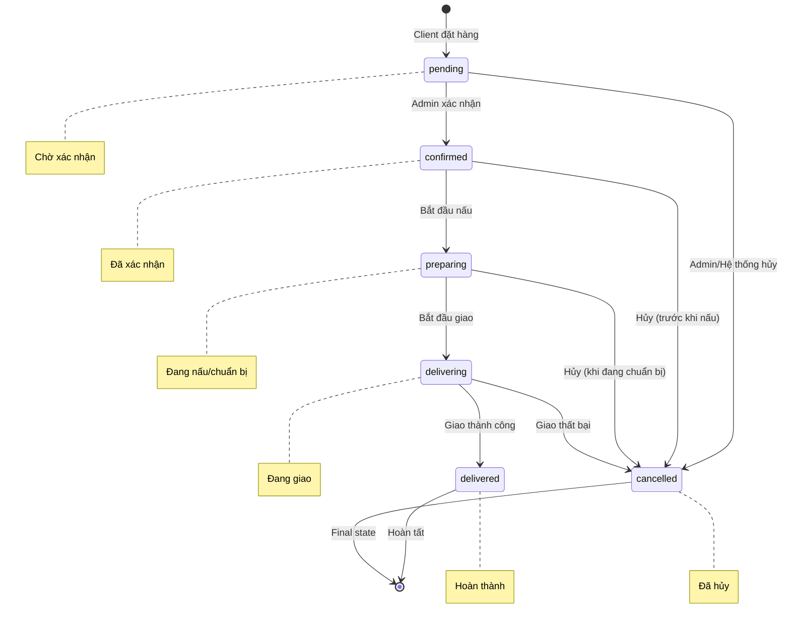

# Sơ đồ luồng - Module Quản lý đơn hàng (Mermaid)

## 1. Load Order List Flow

## 2. Order List Tab Filtering

## 3. Order Detail & Status Update Flow

## 4. Cancel Order Flow

## 5. Order Status State Machine

