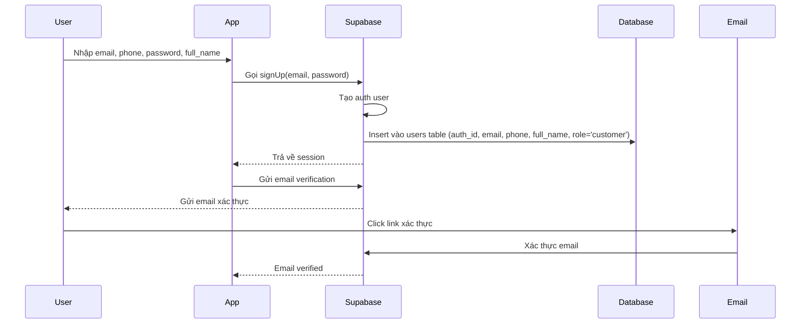
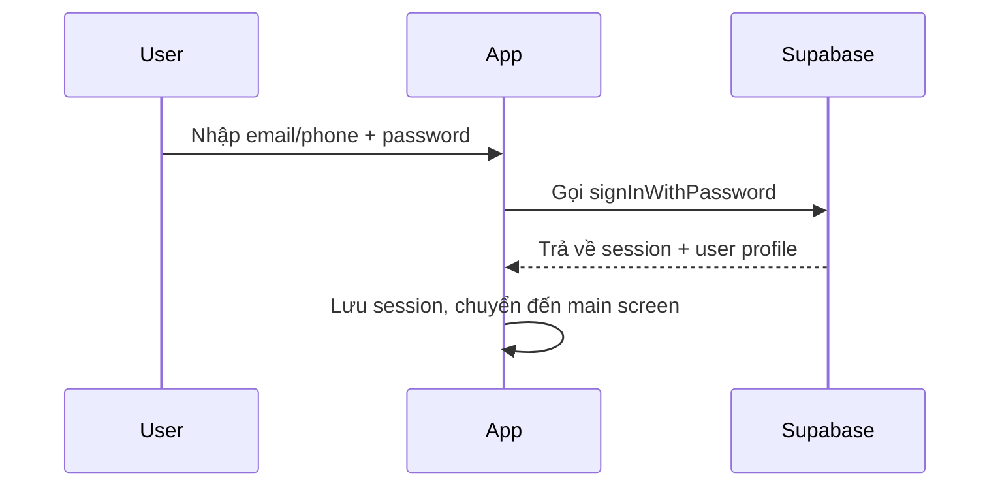
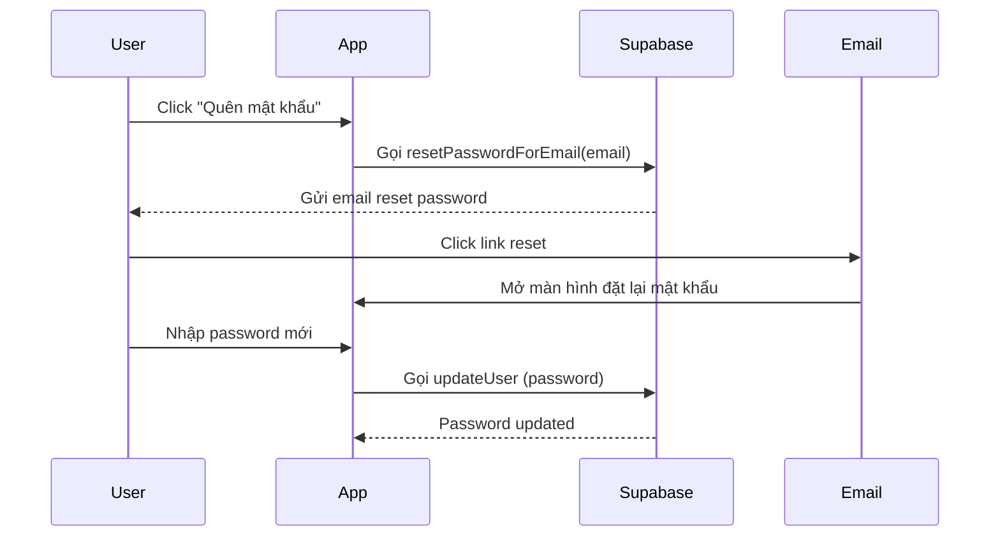

# Authentication Requirements

## 1. Overview

Module xử lý đăng ký và đăng nhập cho ứng dụng Food Ordering. Người dùng mới có thể đăng ký tài khoản bằng email và số điện thoại, sau đó xác thực qua email để kích hoạt tài khoản.

## 2. User Roles

| Role | Description | Permissions |
|------|-------------|-------------|
| `customer` | Khách hàng đặt đồ ăn | Đặt món, quản lý địa chỉ, xem lịch sử |
| `staff` | Nhân viên nhà hàng | Quản lý đơn hàng của nhà hàng được chỉ định |
| `admin` | Quản trị viên | Toàn quyền quản lý hệ thống |

**Default Role**: New registrations default to `customer`.

## 3. Registration Flow

### 3.1 Happy Path

### 3.2 Registration Data

| Field | Type | Required | Validation |
|-------|------|----------|------------|
| `email` | String | Yes | Valid email format, unique |
| `phone` | String | Yes | Vietnam format (84xxx), unique |
| `password` | String | Yes | Min 8 chars |
| `full_name` | String | Yes | Min 2 chars, max 100 chars |

### 3.3 Constraints

- Email phải unique trong hệ thống
- Phone phải unique trong hệ thống  
- Password tối thiểu 8 ký tự
- Sau khi đăng ký, user được tạo trong `public.users` với `role = 'customer'`

## 4. Login Flow

### 4.1 Happy Path

### 4.2 Login Options

| Method | Description |
|--------|-------------|
| Email + Password | Đăng nhập bằng email |
| Phone + Password | Đăng nhập bằng số điện thoại |

## 5. Password Reset Flow

## 6. Session Management

- Lưu JWT tokens trong local storage an toàn
- Tự động refresh token khi hết hạn
- Đăng xuất xóa toàn bộ session

## 7. Non-Functional Requirements

| Requirement | Description |
|-------------|-------------|
| Performance | Login/Register response < 3s |
| Security | Password không được lưu plain text, dùng Supabase Auth |
| Error Handling | Hiển thị thông báo lỗi chi tiết cho user |

## 8. Edge Cases

| Scenario | Handling |
|----------|-----------|
| Email đã tồn tại | Hiển thị lỗi "Email đã được sử dụng" |
| Phone đã tồn tại | Hiển thị lỗi "Số điện thoại đã được sử dụng" |
| Email không hợp lệ | Hiển thị lỗi validation |
| Network lỗi | Hiển thị "Không có kết nối mạng" |
| Email verification thất bại | Cho phép gửi lại email verification |
